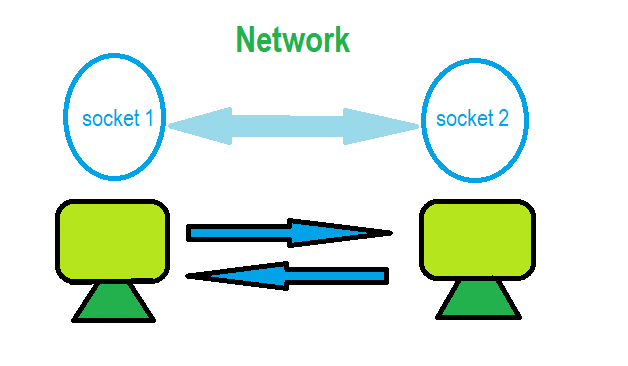

# Documentación del Proyecto

Este proyecto incluye implementaciones de varias tecnologías de comunicación y acceso a datos en Java. A continuación, se detallan brevemente cada una de estas tecnologías junto con una imagen representativa.

## Sockets

Los Sockets en Java proporcionan una forma para que las aplicaciones se comuniquen entre sí a través de la red. Se utilizan para establecer conexiones de red y permiten la transferencia de datos bidireccional. Aquí hay una representación visual de Sockets:

## Websockets

Los Websockets son una tecnología que proporciona un canal de comunicación bidireccional y de bajo nivel entre el cliente y el servidor sobre un único socket TCP. Esto permite una comunicación más eficiente y en tiempo real entre el cliente y el servidor. Aquí hay una representación visual de Websockets:

## RMI JDBC

RMI (Remote Method Invocation) en Java permite la comunicación entre procesos distribuidos en diferentes JVM. JDBC (Java Database Connectivity) proporciona una interfaz para acceder a bases de datos relacionales desde Java. Aquí hay una representación visual de RMI JDBC:

## Soap JDBC

SOAP (Simple Object Access Protocol) es un protocolo de comunicación basado en XML utilizado para intercambiar información estructurada entre aplicaciones web. JDBC (Java Database Connectivity) es una API de Java para acceder a bases de datos relacionales. Aquí hay una representación visual de Soap JDBC:

## Rest JDBC

REST (Representational State Transfer) es un estilo de arquitectura para el desarrollo de servicios web. JDBC (Java Database Connectivity) es una API de Java para acceder a bases de datos relacionales. Aquí hay una representación visual de Rest JDBC:

## Graphql

GraphQL es un lenguaje de consulta y manipulación de datos para APIs, y un entorno de tiempo de ejecución para ejecutar estas consultas con los datos existentes. Aquí hay una representación visual de GraphQL:

